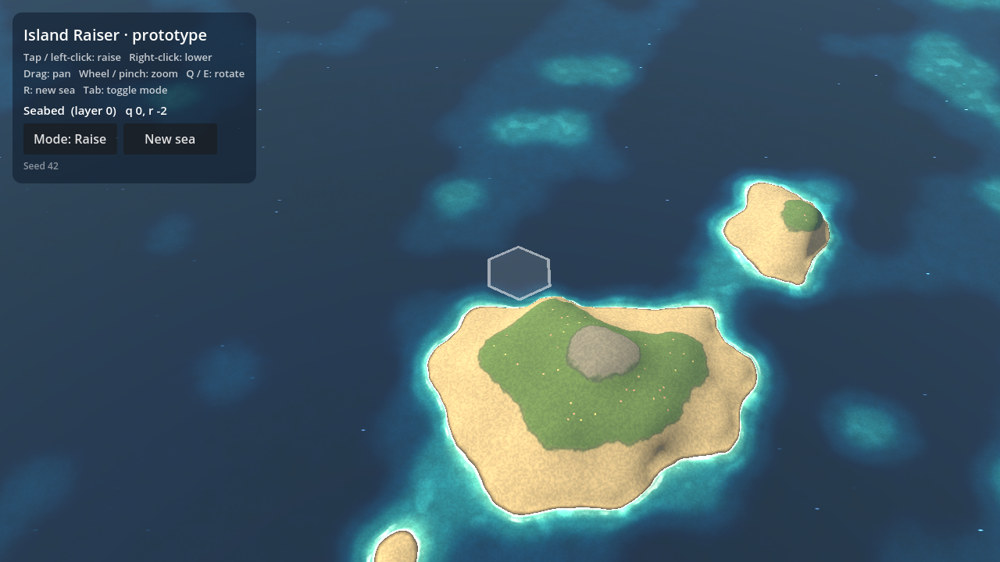

# Island Raiser

A cozy island builder on an endless painted sea, built with **Godot 4** (4.3+).
See [`docs/concept.md`](docs/concept.md) for the full concept.



## Status: first prototype (the make-or-break look test)

From the concept doc, the first prototype covers:

1. Tap a hex to raise or lower its height, from seabed to summit.
2. Heights blend into one smooth island, painted by a single water and land shader.
3. Foam along the coast, plus a ghost hex under the pointer.

Also in: a seeded sea generated from noise, rise and sink tweens with a splash
ripple, pan and zoom, and a HUD with mode toggle and new-sea button.

## Play in the browser

Every push to `main` (or the prototype branch) is exported to the web and deployed
to GitHub Pages by `.github/workflows/pages.yml`. It's at
**https://mario-gjashta.github.io/Islands/** once Pages is enabled
(Settings → Pages → Source: **GitHub Actions**). It works on phones too: tap to
raise, drag to pan, pinch to zoom. The panel's corner shows the build (commit)
you're running. Each release gets unique file names (`tools/stamp_web_build.sh`),
so a refresh never mixes a new page with old cached game files.

## Running locally

Open the folder in Godot 4.3+ and press **F5**, or:

```sh
godot --path .
```

| Input | Action |
| --- | --- |
| Tap / left-click | Raise the hex one layer (or lower it in Lower mode) |
| Right-click | Lower the hex one layer |
| Drag, middle-drag, WASD / arrows | Pan |
| Q / E | Rotate the view |
| Wheel / pinch (trackpad or two fingers) | Zoom at the pointer |
| Tab | Toggle Raise / Lower mode |
| R | New sea (new seed) |
| Sample island button | Raise a ready-made mountain island to see every layer |

## How it works

- **Logic on hexes** (`scripts/hex.gd`, `scripts/hex_grid.gd`): pointy-top axial
  coordinates and a hex-shaped map that stores one integer layer per cell
  (0 seabed, 1 reef, 2 shallows, 3 beach, 4 meadow, 5 hills, 6 highland,
  7 mountain, 8 summit).
- **Rendering without hexes** (`scripts/sea_renderer.gd`, `shaders/`): a 3D
  scene seen from an angled camera (`scripts/camera_rig.gd`, about 50°).
  Displayed heights live in a tiny float texture, one texel per hex.
  `terrain.gdshaderinc` turns it into one height field: a gaussian blend of
  the nearby hexes with a noise warp (soft coastlines), pointed peaks that
  grow sharper on higher hexes, and ridged crags on mountain ground. Higher
  layers also rise more steeply, so mountains tower over the lowlands.
  That field is baked into a height map whenever the land changes
  (`height_bake.gdshader`), and the terrain mesh and trees read it.
- **Painting** (`sea.gdshader`): per pixel, by height and slope. Water by depth
  with caustics, coastal foam, swells and glints; then sand, flowered meadow,
  mossy forest floor, scree, banded rock strata, and snow caps that slide off
  steep faces. Steep slopes break out into bare cliffs. Wet edges and paper
  grain over everything; a side-on sun with shadows and fog to the horizon.
- **Trees** (`trees.gdshader`): candidates are scattered over every hex, and
  each one reads the ground under it to decide whether it grows. You get a few
  broad trees on meadows (layer 4), forest on the hills (5), and slim conifers
  thinning out on the highlands (6). Above that is the tree line. Trees grow
  and recede on their own as the land rises and sinks.
- **Feel** (`scripts/ghost_hex.gd`, `scripts/splash.gd`): the ghost hex drops out
  when a tile lands and drifts back in; tiles rise with an overshoot tween and a
  foam ripple.

The shader's look is tuned by uniforms (`blend_falloff`, `coast_warp`, `sea_level`,
and the palette colours), which you can tweak live on the `Sea` node's material.

## Tests and screenshots

```sh
# Logic tests (headless)
godot --headless --path . -s res://tests/run_tests.gd

# Web export (needs the 4.3 web export templates installed)
godot --headless --path . --export-release "Web" build/web/index.html

# Render the sample island to a PNG (needs a display, or xvfb-run on Linux)
godot --path . -s res://tests/capture_screenshot.gd -- out.png
```

## Next steps (from the concept)

- Layer rule: land rises only on shallow water, so islands grow outward.
- Tile types beyond height (reef, sandbank, lagoon, forest, rock…).
- Current flow field over the hex grid, drawn as painted streaks.
- Wind, adjacency habitats, species arrivals and the field guide.
- The boat as cursor, with placement reach; Voyage and Drift modes.
