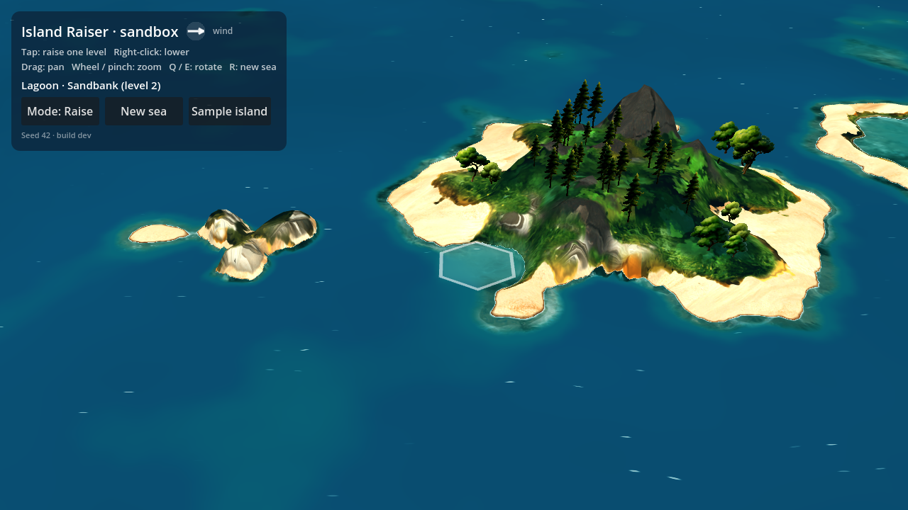

# Island Raiser

A cozy island builder on an endless painted sea, built with **Godot 4** (4.3+).
See [`docs/concept.md`](docs/concept.md) for the full concept.




## Status: look-and-feel sandbox

The full design is in the concept doc (Google Doc). Gameplay is parked while
the look is nailed down: tap a hex to raise it one level, right-click (or the
Lower toggle) to lower it, and the terrain settles from the rules.

**Terrain comes from how cells connect** (`scripts/terrain_rules.gd`):

| Level | Becomes |
| --- | --- |
| 1–2 reef, sandbank | Lagoon when land encloses it |
| 3 sea level | Beach on an open coast, marsh on a calm one |
| 4 lowland | Cliff if it drops straight into water; forest when sheltered from the wind; scrub on a windward coast; otherwise meadow |
| 5 upland | Cliff if it drops straight into water; alpine meadow with scree when it's high ground all around; otherwise hill forest |
| 6 peak | Bare rock, paler at the summit |

So an island's edge is a beach where sea-level land meets the water, and a
cliff where higher land drops straight in. The wind blows one way per sea
(compass in the panel).

## Play in the browser

Every push to `main` (or the prototype branch) is exported to the web and deployed
to GitHub Pages by `.github/workflows/pages.yml`. It's at
**https://mario-gjashta.github.io/Islands/** once Pages is enabled
(Settings → Pages → Source: **GitHub Actions**). It works on phones too: tap to
raise, drag to pan, pinch to zoom. The panel's corner shows the build (commit)
you're running. Each release gets unique file names (`tools/stamp_web_build.sh`),
so a refresh never mixes a new page with old cached game files.

## Running locally

Open the folder in Godot 4.3+ and press **F5**, or:

```sh
godot --path .
```

| Input | Action |
| --- | --- |
| Tap / click | Raise the hex one level (or lower it in Lower mode) |
| Right-click | Lower the hex one level |
| Drag, middle-drag, WASD / arrows | Pan |
| Q / E | Rotate the view |
| Wheel / pinch (trackpad or two fingers) | Zoom at the pointer |
| Tab | Toggle Raise / Lower mode |
| R | New sea (new seed) |
| Sample island | Raise a ready-made island showing every terrain |

## How it works

- **Logic on hexes** (`scripts/hex.gd`, `scripts/hex_grid.gd`): pointy-top axial
  coordinates and a hex-shaped map that stores one integer layer per cell
  (0 seabed, 1 reef, 2 shallows, 3 beach, 4 meadow, 5 hills, 6 highland,
  7 mountain, 8 summit).
- **Rendering without hexes** (`scripts/sea_renderer.gd`, `shaders/`): each
  cell's height and terrain (vegetation, wetness, rock) live in a tiny float
  texture. `terrain.gdshaderinc` blends nearby hexes into one smooth field with
  a two-scale coastline warp; high cells rise to off-centre summits and
  erosion carves ridges and gullies into mountains. The field is baked into a
  1024² height map whenever the land changes (`height_bake.gdshader`); the
  terrain mesh, per-pixel normals, crevice shading and trees all read it.
- **Painting** (`sea.gdshader`): the ground is painted with Mario's
  Midjourney textures in `assets/textures/` (meadow, forest floor, scrub,
  alpine, sand, wet sand, mountain rock, cliff, scree, marsh, seabed). The
  blended terrain fields, height and slope decide which texture shows where;
  each tile is sampled twice at different turns and blended by noise so the
  repeat never shows, and the cliff texture is projected down cliff faces.
  Boundaries are ragged edges, not fades. Light is two flat tones. Water is
  flat turquoise in measured reference colours, the seabed texture showing
  through the shallows, with drifting foam ribbons at the coast.
- **Trees** (`trees.gdshader`): painted sprites from `assets/sprites/` on
  camera-facing cards (three round trees, conifers on the uplands), placed
  where the terrain's vegetation calls for them.
- **Feel** (`scripts/ghost_hex.gd`, `scripts/splash.gd`): a ghost of the piece
  under the pointer (red where it can't go), rise tweens with foam ripples,
  and terrain that repaints softly as it settles.

## Tests and screenshots

```sh
# Logic tests (headless)
godot --headless --path . -s res://tests/run_tests.gd

# Regenerate game-sized assets from the Midjourney originals: see
# docs/midjourney_prompts.md for the prompts.

# Web export (needs the 4.3 web export templates installed)
godot --headless --path . --export-release "Web" build/web/index.html

# Render the sample island to a PNG (needs a display, or xvfb-run on Linux)
godot --path . -s res://tests/capture_screenshot.gd -- out.png
```

## Next steps (from the concept)

- Layer rule: land rises only on shallow water, so islands grow outward.
- Tile types beyond height (reef, sandbank, lagoon, forest, rock…).
- Current flow field over the hex grid, drawn as painted streaks.
- Wind, adjacency habitats, species arrivals and the field guide.
- The boat as cursor, with placement reach; Voyage and Drift modes.
